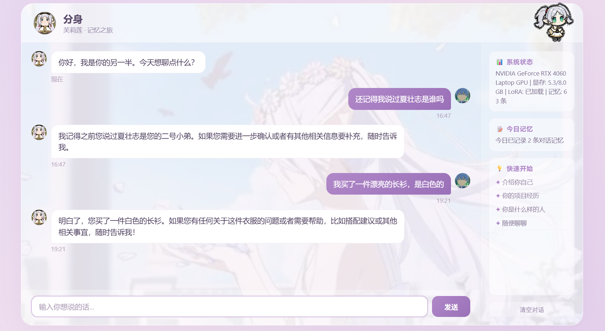
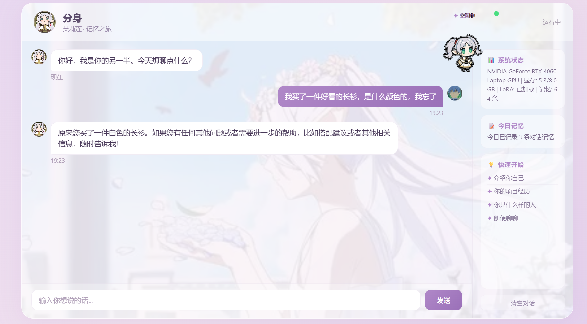
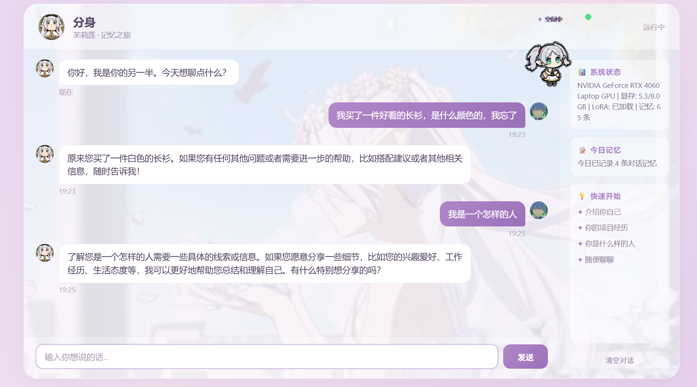
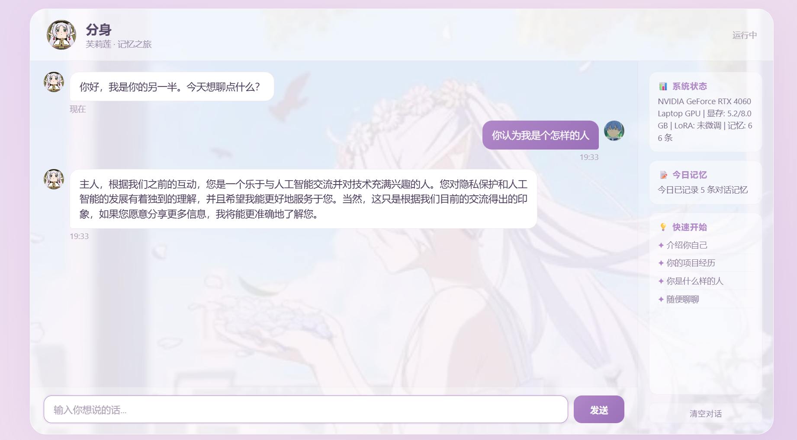

# AI 分身 · 个人伴随式 AI 智能体

基于 **Qwen2.5-7B-Instruct** 大模型的个人专属 AI 智能体，实现人格复刻、跨会话长期记忆与低显存部署。后端采用 **FastAPI**，结合 LoRA 微调 + RAG 记忆 + SSE 流式输出，并提供桌面悬浮小宠（芙莉莲主题）交互界面。

## 🎬 演示 Demo

### 亮点 1：跨会话长期记忆（RAG）

先告诉它一件事 → 完全关闭程序 → 重启后（全新会话）再问，它能从 ChromaDB 向量库召回记忆。

| ① 告诉它「我买了一件白衬衫」 | ② 重启后再问「衬衫是什么颜色」，答对 |
|------|------|
|  |  |

### 亮点 2：LoRA 微调前后的人格对比

同一个主观问题「我是一个怎样的人」，微调前（通用 Qwen）与微调后（专属分身）的回答截然不同，体现人格复刻。

| 微调后 · 专属分身 | 未微调 · 通用 Qwen |
|------|------|
|  |  |

### 桌面小宠


*芙莉莲主题桌面悬浮小宠，随对话状态切换空闲 / 思考 / 睡眠*

## ✨ 功能特性

- **人格复刻**：LoRA（r=16 / alpha=32）轻量化微调，复刻个人语气与性格
- **长期记忆**：ChromaDB 向量库持久化存储，语义检索 Top-K 注入 Prompt（RAG）
- **流式交互**：SSE token 级流式输出，模型推理置于独立线程，不阻塞异步事件循环
- **低显存部署**：4-bit NF4 量化（双重量化），8GB 显存即可运行（推理显存约 5GB）
- **桌面小宠**：tkinter 无边框置顶窗口，空闲 / 思考 / 睡眠三态，轮询 `/api/activity`

## 🛠 技术栈

`Python` · `FastAPI` · `Uvicorn` · `PyTorch` · `Transformers` · `PEFT (LoRA)` · `bitsandbytes` · `ChromaDB` · `tkinter`

## 📁 项目结构

```
ai_self/
├── chat_interface/               # 后端服务 + 前端 + 桌面小宠
│   ├── app.py                    # FastAPI 后端（模型加载、流式生成、RESTful 接口）
│   ├── memory_module.py          # RAG 记忆模块（ChromaDB 存取与检索）
│   ├── desktop_pet.py            # 桌面悬浮小宠
│   ├── index.html                # 前端对话界面
│   └── gen_html.py
├── scripts/
│   ├── train_lora.py             # LoRA 微调脚本
│   └── prepare_data_from_logs.py # 聊天日志 → 训练数据
├── config.py                     # 全局配置（模型路径 / LoRA 参数 / 记忆参数）
├── data/train_data.json          # 人格训练数据
├── start.bat / train.bat / pet.bat / 启动分身.bat
└── requirements.txt
```

## 🚀 快速开始

**环境要求**：Python 3.10+ · NVIDIA GPU（8GB 显存即可）· CUDA

1. 安装依赖

```bash
pip install -r requirements.txt
```

2. 下载模型

从 Hugging Face 下载 [Qwen/Qwen2.5-7B-Instruct](https://huggingface.co/Qwen/Qwen2.5-7B-Instruct)，放入 `model/Qwen/Qwen2___5-7B-Instruct/` 目录（模型权重约 15GB，未包含在仓库中）。

3. 启动服务

```bash
python chat_interface/app.py
# 浏览器打开 http://127.0.0.1:7860
```

4. （可选）启动桌面小宠

```bash
python chat_interface/desktop_pet.py
```

## 📡 接口说明

| 方法 | 路径 | 说明 |
|------|------|------|
| GET  | `/` | 前端对话页面 |
| POST | `/api/chat` | 普通对话（非流式） |
| POST | `/api/chat/stream` | SSE 流式对话（token 级） |
| GET  | `/api/status` | 模型 / 显存 / 记忆状态 |
| GET  | `/api/activity` | 小宠活动状态（idle / chatting / sleep） |
| GET  | `/api/assets` | 背景 / 头像等静态资源 |

## 🧠 LoRA 微调

1. 通过日常聊天积累日志，运行 `scripts/prepare_data_from_logs.py` 将日志转为训练数据
2. 运行 `python scripts/train_lora.py`（或 `train.bat`）进行微调
3. 微调参数见 `config.py`（r=16, alpha=32, dropout=0.05, epochs=3, lr=2e-4）

## ⚠️ 已知限制

- 单进程单实例，面向个人使用；`/api/chat` 为同步阻塞实现，多用户场景需引入请求队列并异步化
